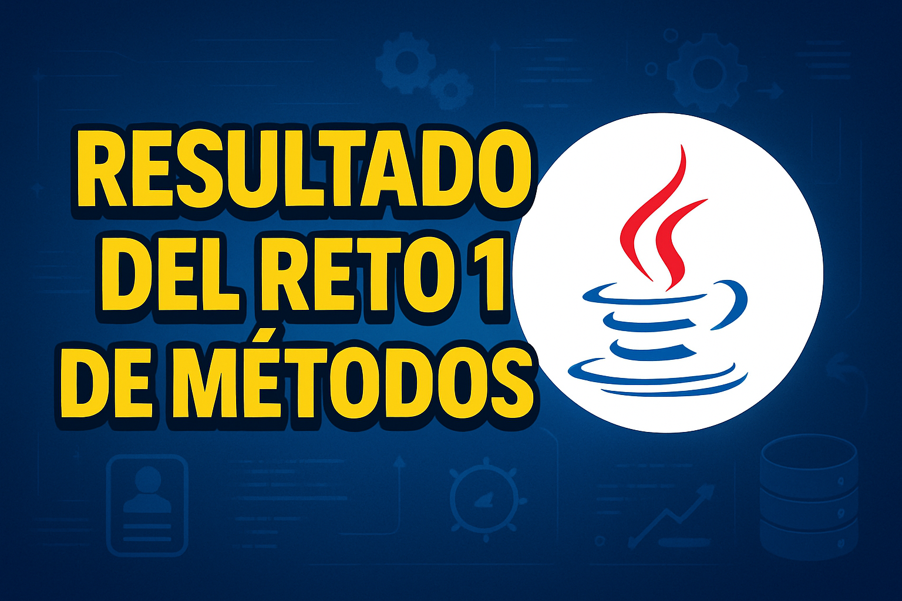

 
<h1 align="center">🎯 Reto de Métodos #1</h1>

¡Bienvenido al primer reto de programación orientado al uso de métodos en Java! Este ejercicio está diseñado para fortalecer la comprensión de cómo se estructuran, invocan y aplican los métodos dentro de un programa con lógica interactiva.

   

 
 
<h2 align="left">🎮 Que comience el juego</h2>

<strong>Reto 1</strong>

Una persona retó a un estudiante de ingeniería de sistemas a desarrollar un programa que utilice métodos en Java. El programa debe permitir:

<ul align="left">
  <li>Crear una cuenta.</li>
  <li>Visualizar un menú principal con distintas opciones.</li>
  <li>Acceder a un portal de trabajo.</li>
  <li>Permitir el acceso al portal de trabajo únicamente si se ha creado una cuenta previamente.</li>
</ul>
 

 
<h2 align="left">🛠️ ¿Cómo lo podemos solucionar?</h2>

Para dar solución a este reto, nos hacemos las siguientes preguntas:

<h3 align="left">🔹 ¿Cómo lo hago?</h3>

Utilizamos la programación modular en Java. Separamos cada funcionalidad importante del programa en métodos distintos. Esto nos permite mantener un código más limpio, reutilizable y fácil de mantener.

<h3 align="left">🔹 ¿Cómo se hace?</h3>

A través de la declaración de métodos <code>public static</code>, se definen funciones como <code>bienvenida()</code>, <code>nueva_cuenta()</code>, <code>portaltrabajo()</code>, entre otros. Cada uno tiene una responsabilidad específica:

<ul align="left">
  <li><code>bienvenida()</code>: Muestra el mensaje de bienvenida al usuario.</li>
  <li><code>ejercicio()</code>: Expone el reto al usuario.</li>
  <li><code>menu()</code>: Invoca el menú principal.</li>
  <li><code>selector_menu()</code>: Presenta las opciones disponibles.</li>
  <li><code>nueva_cuenta()</code>: Permite registrar una cuenta introduciendo un nombre.</li>
  <li><code>cuenta_actual()</code>: Muestra los datos de la cuenta creada.</li>
  <li><code>portaltrabajo()</code>: Simula un portal con ofertas laborales.</li>
  <li><code>portalvalidation()</code> y <code>verificarCuenta()</code>: Verifican si el usuario tiene una cuenta antes de acceder al portal.</li>
</ul>

<h3 align="left">🔹 ¿Cuál es el resultado?</h3>

El resultado es un programa interactivo en consola que simula un sistema básico de cuenta de usuario con acceso condicionado al portal de trabajo. El flujo de interacción garantiza que el usuario no pueda acceder al portal sin haber creado primero una cuenta válida, asegurando así una secuencia lógica y protegida en el uso del sistema.

<h3 align="left">🔢 Paso a paso de ejecución:</h3>

<ol align="left">
  <li>Se da la bienvenida al usuario con <code>bienvenida()</code>.</li>
  <li>Se presenta el reto mediante <code>ejercicio()</code>.</li>
  <li>El menú principal se muestra con <code>menu()</code>.</li>
  <li>El usuario puede elegir entre:
    <ul>
      <li>Crear cuenta: se invoca <code>nueva_cuenta()</code>.</li>
      <li>Ver cuenta: se muestra la cuenta con <code>cuenta_actual()</code>.</li>
      <li>Acceder al portal: se valida con <code>portalvalidation()</code> si el usuario tiene cuenta.</li>
    </ul>
  </li>
  <li>Si el usuario accede al portal y tiene cuenta, puede aplicar a distintas ofertas laborales.</li>
  <li>El programa continúa ejecutándose en bucle mientras el usuario lo desee.</li>
</ol>
 

 

<h2 align="center">Resultado</h2>
    <table>
  <tr>
    <td align="center">
       
      
<strong>Resultado Reto#1</strong>

      
    </td>
  </tr>
</table>

 

 

💡 Este reto es una excelente introducción al uso de métodos en Java y su aplicación práctica en programas orientados al usuario. Fomenta el pensamiento estructurado y la organización del código según sus funcionalidades.

 
